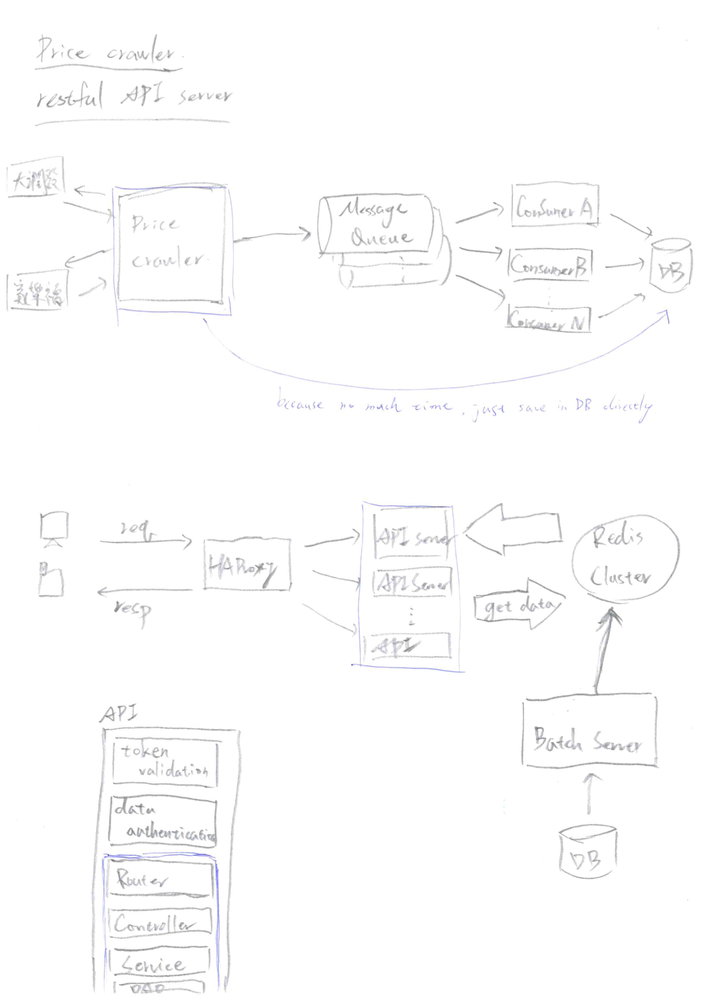
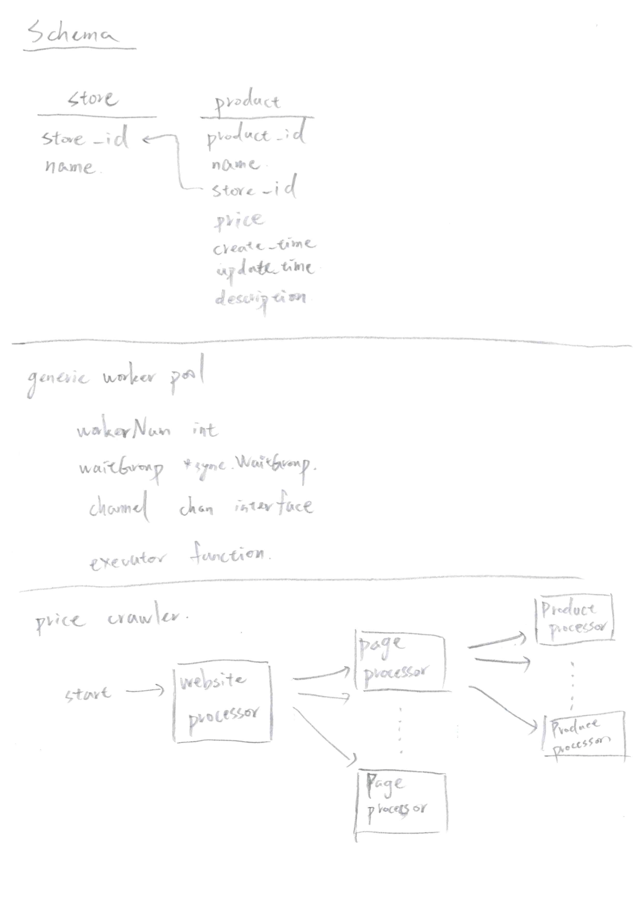

# API Server & Price Crawler Job
This project consists of RESTful API server and price crawler batch job.
The architecture of initital design is written on the first day.
Due to time considerations , I implement the system by the architecture of POC.

## Contents
* [Architectue](#Architectue)
* [How to Develop](#how-to-develop)
* [How to build](#how-to-build) 
* [How to run](#how-to-run)
* [API](#api)
* [Other Improvement](#other-improvement)
---
## Architectue

* Initial design
1. Crawler and API Server
 

</img>
2. Schema and Worker Pool
 

</img>
3. Implement for POC

## How to Develop
<pre>
cd ~/go/src/product-query
</pre>
1. Use govendor download packages
<pre>
go get -u github.com/kardianos/govendor
govendor sync
</pre>
2. develop api
<pre>
go run main/api.go --config-path config/config.json --log-config-path config/logger.json
</pre>
3. develop batch job
<pre>
go run main/batch.go --job-name priceCrawler --config-path config/config.json --log-config-path config/logger.json
</pre>
## How to build
<pre>sh build.sh</pre>
## How to run
1. run api server (port:11968)
<pre>
sh script/api.sh start|stop|status
</pre>
2. price crawler
<pre>
sh script/priceCrawler.sh
</pre>

## API
* Semantics & URL
<table>
    <thead>
        <tr>
            <th>Method</th>
            <th>URL</th>
            <th>Description</th>
        </tr>
    </thead>
    <tbody>
        <tr>
            <td>GET</td>
            <td>
            http://${Host}/v1/product?product_id={id}
            http://${Host}/v1/product?product_name=${name}&page=${page}&size=${size}
            </td>
            <td>Get data information
            page：start from 1 ... N
            size：items of each page
            </td>
        </tr>
        <tr>
            <td>POST</td>
            <td>
            http://${Host}/v1/product
            </td>
            <td>Create</td>
        </tr>
        <tr>
            <td>PUT</td>
            <td>
            http://${Host}/v1/product
            </td>
            <td>Update</td>
        </tr>
        <tr>
            <td>DELETE</td>
            <td>
            http://${Host}/v1/product?product_id={id}
            </td>
            <td>Remove data</td>
        </tr>
        <tr>
            <td>PATCH</td>
            <td>
            http://${Host}/v1/product
            </td>
            <td>Sync data , create / update</td>
        </tr>
    </tbody>
</table>

* Json Field
<table>
    <thead>
        <tr>
            <th>Field</th>
            <th>Type(Length)</th>
            <th>Description</th>
            <th>Required On</th>
        </tr>
    </thead>
    <tbody>
        <tr>
            <td>ProductId</td>
            <td>Long</td>
            <td>Primary key</td>
            <td>GET,PUT,DELETE</td>
        </tr>
        <tr>
            <td>Name</td>
            <td>String(100)</td>
            <td>Product name for query</td>
            <td>POST,PUT,PATCH</td>
        </tr>
        <tr>
            <td>Website</td>
            <td>String(30)</td>
            <td>Website for record , ex pchome、tkec、momo...</td>
            <td>POST,PUT,PATCH</td>
        </tr>
        <tr>
            <td>SiteProductId</td>
            <td>String(200)</td>
            <td>The id of owner website</td>
            <td>POST,PUT,PATCH</td>
        </tr>
        <tr>
            <td>Link</td>
            <td>String</td>
            <td>The url of product</td>
            <td>POST,PUT,PATCH</td>
        </tr>
        <tr>
            <td>Price</td>
            <td>Integer</td>
            <td></td>
            <td>POST,PUT,PATCH</td>
        </tr>
        <tr>
            <td>Picture</td>
            <td>String</td>
            <td>The image url of product</td>
            <td>POST,PUT,PATCH</td>
        </tr>
        <tr>
            <td>Desciprtion</td>
            <td>String</td>
            <td></td>
            <td></td>
        </tr>
    </tbody>
</table>

## Other Improvement
1. Error handle and status code for API.
2. Modulize service and dao for project.
3. Optimize price crawler and cache some fixed value (like category,item...)
4. Monitor api server status and get metrics.
5. Need more analysis for each website and path rule.
